# Custom plugin development using Gradle

This tutorial describes how to get started with a basic Gradle project and create a simple plugin extension using Gradle.

The first part explains how to set up a basic Gradle "Hello World" project and run a greeting task. The second part helps you write a custom Greeting plugin using Kotlin.
If you're new to Gradle, read [Gradle docs](https://docs.gradle.org/current/userguide/getting_started_eng.html) for more information about Gradle and its features.

> **Note:** What you should know
> - A knowledge of Java or Kotlin is required.
> - A hands-on experience with IntelliJ IDEA or any modern IDE is good to have.

> **Note:** Prerequisites to get started
> - Download and install JDK version 11 or newer on your machine. For information on how to install JDK, see [install JDK.](https://docs.oracle.com/en/java/javase/21/install/overview-jdk-installation.html).
> - Download and install Gradle version 8 or newer on your machine. For information on how to install Gradle, see [install gradle](https://gradle.org/install/).
> - Download and install IntelliJ IDEA on your machine. If you don't prefer IntelliJ, you can install any other IDE of your choice.

## Setting up a basic Gradle project
If you know how to create a basic Gradle project, you can skip forward to [Creating the Greeting Plugin](#creating-a-greeting-plugin). Once you install all the prerequisites, follow the steps listed below to create and build a basic Gradle project:

1. Open IntelliJ IDEA and create a new project with preset values as shown below:

   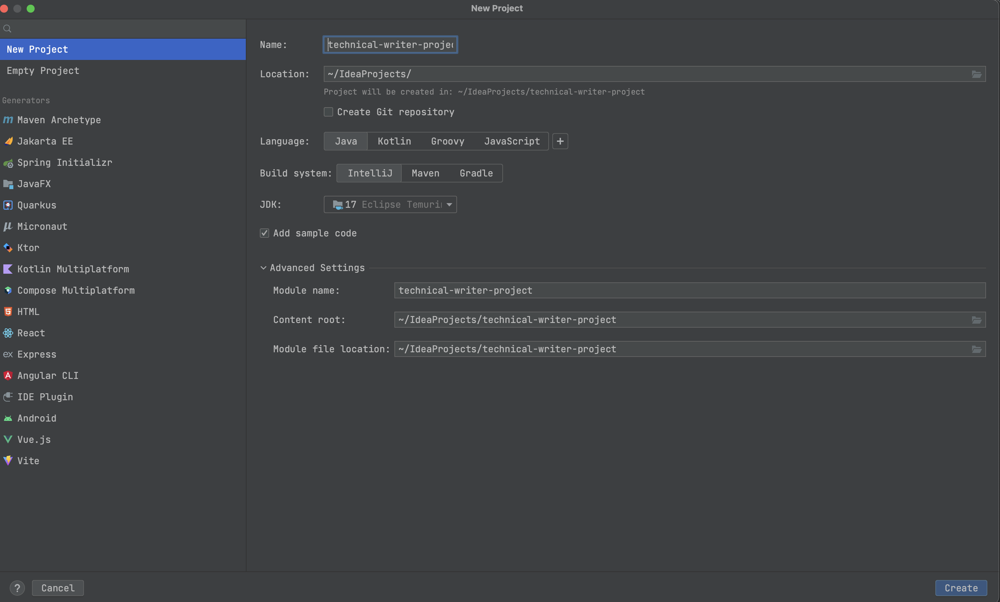

2. Open a terminal and navigate to the project folder. Run `gradle init`. This command will help set up a Gradle "Hello World" project with `Java` as the source code language and `Kotlin` as the build script language. You can choose the following presets if you're not sure of the choices.

   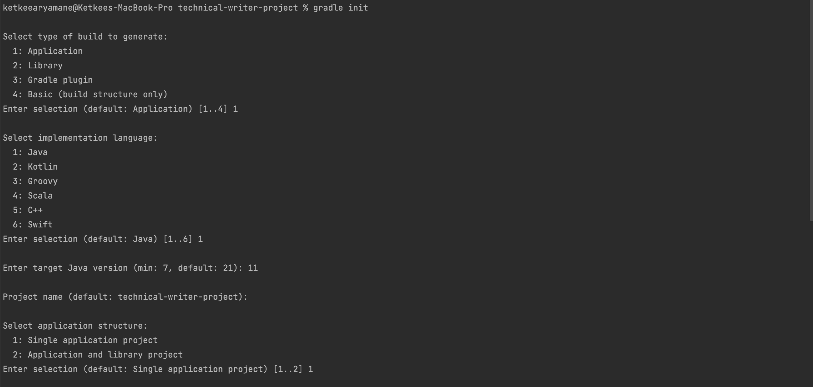

   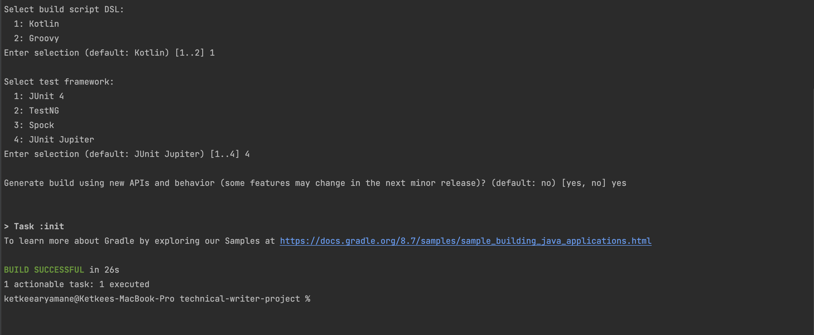

   After you run this command, your project structure should look as shown below:

   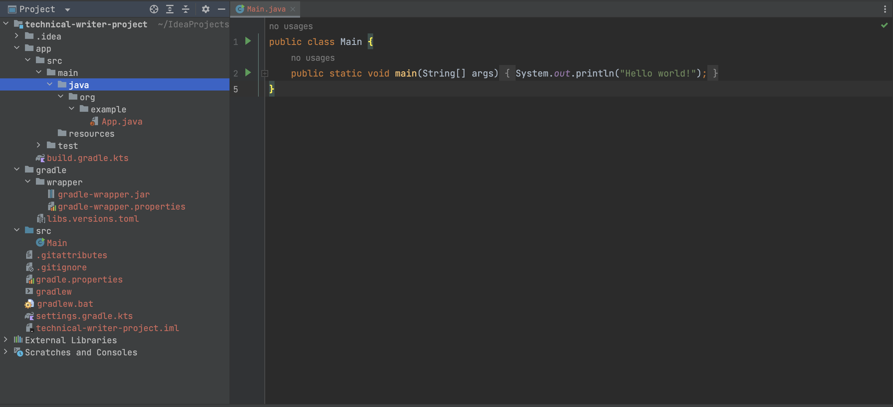

   Following are some important folders and files to know:
   - `app` folder: Contains the `build` and `source` folders for your project.
   - `gradle` folder: Contains code for gradle wrapper files and a `libs.versions.toml` file. The optional `libs.versions.toml` file is used as a catalog to maintain the versions of all dependencies for your project.
   - `build.gradle.kts` : The build script for the project.
   - `gradlew` and `gradlew.bat` : The gradle wrapper scripts to run on OSX and Windows platforms. These scripts ensure that the build is run with the same Gradle version as the project irrespective of the Gradle version installed on the platforms.

3. Run `gradle build` to build the project. The build should complete successfully. For any problems, refer to the console errors to debug and fix issues.

4. Run `gradle run` to run the project. It will display "Hello World!" greeting on your console:

   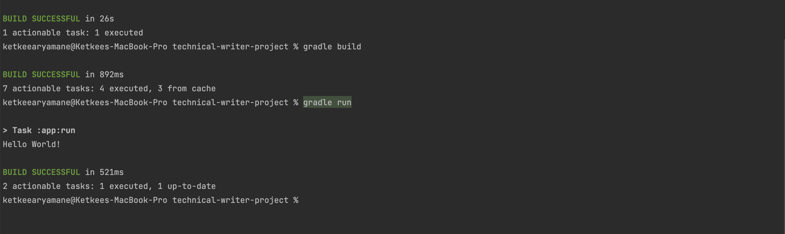

## Creating a Greeting plugin

The Greeting plugin extension writes the greeting message into 2 files, _a.txt_ and _b.txt_, under the `build` folder, in addition to displaying it on your console.

### Gradle plugins
Gradle comes with a powerful set of features like dependency management, project configuration, running builds, and delivering software easily and quickly. However, if you want to perform other tasks like deploying artifacts, configuring projects, enforcing standards, running certain tests, etc.,
you can implement such logic in a Gradle plugin. Plugins are lightweight, easy to maintain, and promote code reusability. For more information, see [Gradle plugins.](https://docs.gradle.org/current/userguide/custom_plugins.html)

### Steps to create the Greeting plugin
To create a custom plugin, you need to write an implementation of a plugin. Gradle will then instantiate the plugin and apply it using `<plugin-name>.apply()` method.

Since the project uses `Kotlin` as the build script language, you need to write all the custom plugin code in the `build.gradle.kts` file.

1. Add a class `Greeting` as shown below. This class extends the _**DefaultTask**_, which will write the "Hello World!" message to files. Remember, all classes in Gradle are always final. So, you need to declare your class as `open` when you want to extend it later.  The class takes inputs 
   into 2 arguments - `message` for the greeting message and `outputFiles` for the file names. It has a function `printMessage` annotated with `@TaskAnnotation` which defines the actual logic of the task.

   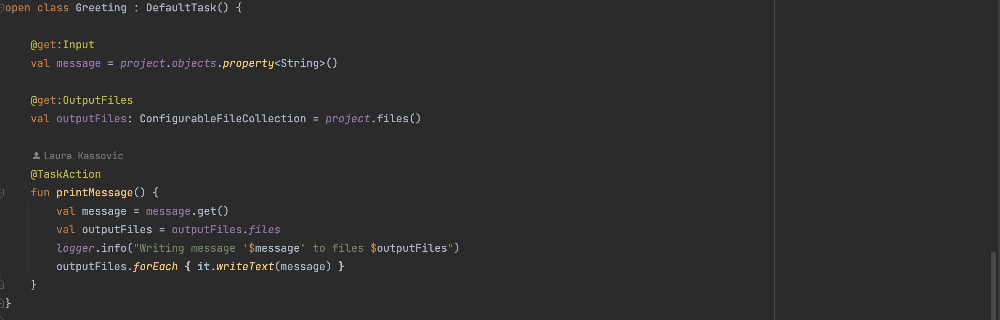

2. Add the `GreetingPluginExtension` class which defines 2 properties - `message` for the greeting message and `outputFiles` for the file names. If you want to set the values for the properties in this class itself and not allow anyone to override them, declare them with the `val` keyword. If you 
   want to configure these properties later, declare them with the `var` keyword.

   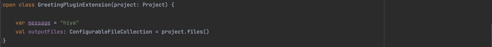

3. Add the plugin definition code in a `GreetingPlugin` class. The plugin will create a `GreetingPluginExtension` object and set up a task `hello` which uses the configuration and executes the logic of writing the message to output files. The `hello` task will be included in the task-group
   `greeting`.

   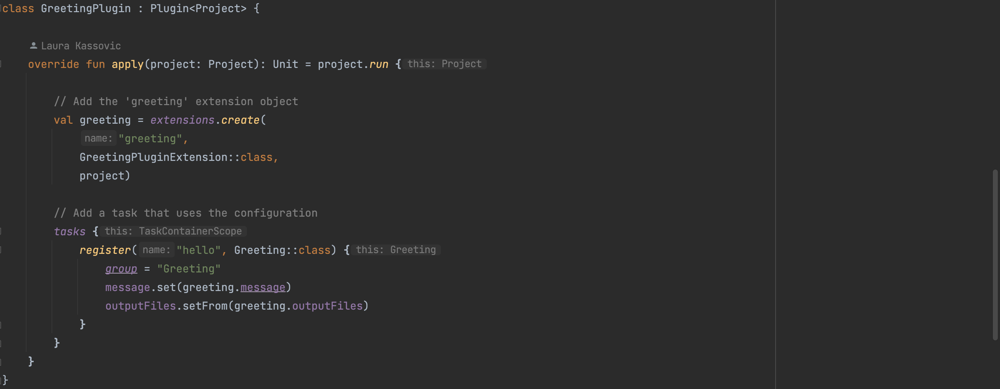

4. Configure the `GreetingPluginExtension` object to set values to its properties.

   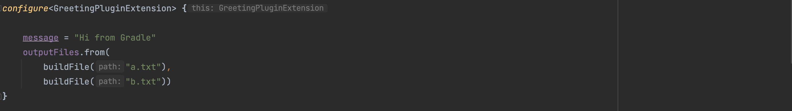

5. Add the `buildFile` function which configures the location for the _a.txt_ and _b.txt_ files. Apply the plugin using `apply<GreetingPlugin>()` at the top of your build file.

   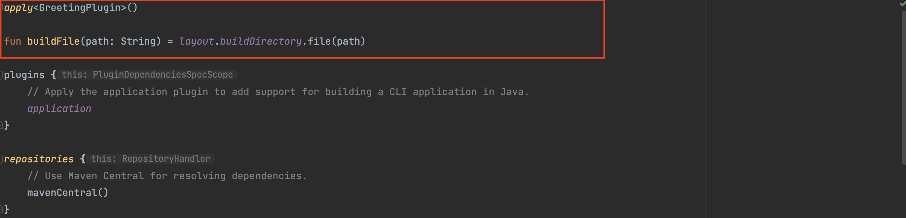

6. Build the project and run `gradle tasks` to check if the new task `hello` is now included in your project's tasks.

   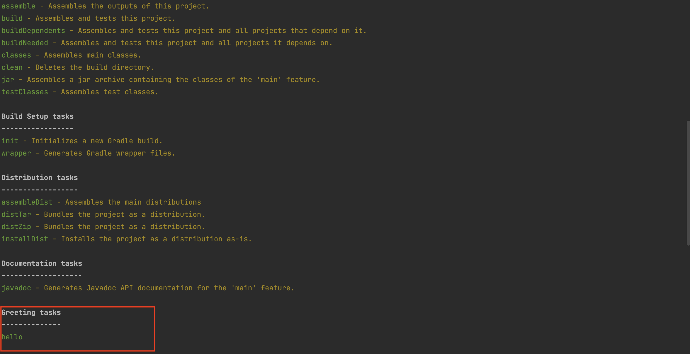

7. You can also run a build scan using `gradle build --scan` to share your build reports to other teams.

8. Run the `hello` task using `gradle -q hello`. This command will write the greeting message to the files _a.txt_ and _b.txt_ under your `build` folder.

   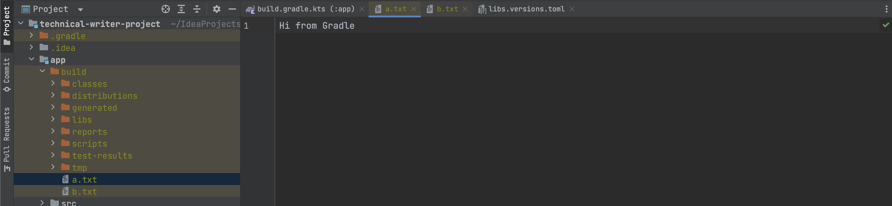

## Related articles

- [Types of plugins](https://docs.gradle.org/current/userguide/plugins.html)
- [Writing different types of plugins](https://docs.gradle.org/current/userguide/writing_plugins.html)

 
